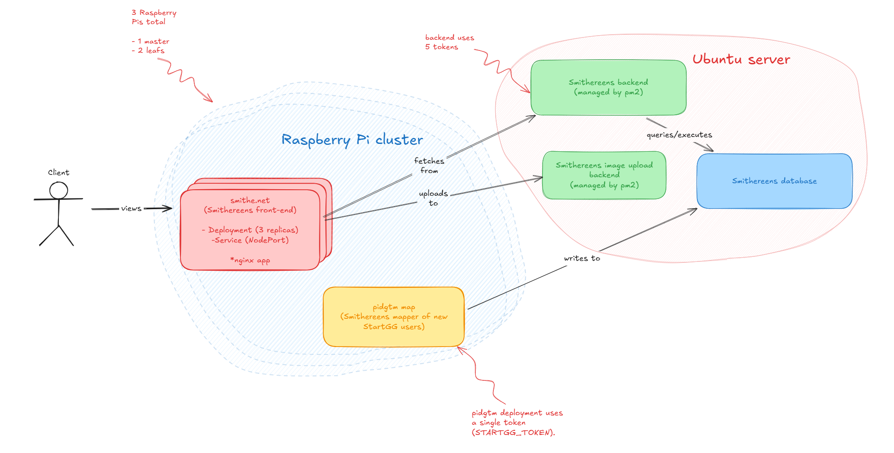

# Maintenance

This file documents a couple of useful maintenance tips for Smithereens.

## `error: You must be logged in to the server (the server has asked for the client to provide credentials)`

This means the k3s certificate has expired. To update, run:

```sh
sudo systemctl restart k3s
```

## Updating tokens

- The front-end has no dependency on the `startgg_api` library, so it issues no token updates.
- We need to update the tokens from the pidgtm deployment (in Raspberry Pi cluster), and the `backend-process` (in Ubuntu server)—see figure below.



> Note: Don't forget to update repo secrets!

### pidgtm deployment

> Last updated: 2024-12-13

- Create new token (in Dantotto account), call it `STARTGG_TOKEN`, and copy it.
- In `rpi-master`, edit the `pidgtm-map-deployment.yml` file (i.e., `sudo nano pidgtm-map-deployment.yml`) secret entries (i.e., `STARTGG_TOKEN`, `STARTGG_TOKEN_1`, `STARTGG_TOKEN_2`, `STARTGG_TOKEN_3`, `STARTGG_TOKEN_4`, `STARTGG_TOKEN_5`, and `STARTGG_TOKEN_6`) to be equal to the value of the `STARTGG_TOKEN` you created.
- Then: `kubectl apply -f ./pidgtm-map-deployment.yml`
- You can check the pidgtm is still working fine with:
```shell
kubectl get pods # should show `deployment-pidgtm-map-xxx...` running
kubectl logs deployment-pidgtm-map-xxx...
```

> Note: On 2024-12-13, I also deployed a job to map player IDs from 1000 to 4463760 (highest at the time). This job should hopefully be complete before the expiry of the token (created on that same date under the name STARTGG_TOKEN-2 in the Dantotto profile). You can view the yaml file for that deployment at `./pidgtm-map-job.yml`.

### `backend-process`

> Last updated: 2024-12-12

pm2 grabs a copy of the environment variables at the time the process starts, so simply updating the environment variables won't anything. We have to update them, and then reload the pm2 process.

`backend-process` uses five distinct tokens (i.e., `STARTGG_TOKEN_1`, `STARTGG_TOKEN_2`, `STARTGG_TOKEN_3`, `STARTGG_TOKEN_4`, and `STARTGG_TOKEN_5`). This is because each StartGG account can only create five tokens. `backend-process` also has a fallback `STARTGG_TOKEN`, but that should be a copy of `STARTGG_TOKEN_1` and a `STARTGG_TOKEN_6`, which is a copy of `STARTGG_TOKEN_6`.

- Create 5 token (in Smithereens account) named `STARTGG_TOKEN_1`, `STARTGG_TOKEN_2`, `STARTGG_TOKEN_3`, `STARTGG_TOKEN_4` and `STARTGG_TOKEN_5`, and copy them.
- In the Ubuntu server, update `~/.profile` with new values (`sudo nano ~/.profile` && `source ~/.profile`)/
- Update pm2 process: `pm2 restart 5 --update-env`.
- You can check to see the updated values with `pm2 env 5`.

### Locally

> Last updated: 2024-12-12

Locally, I have 6 enviroment variables set: `STARTGG_TOKEN`, `STARTGG_TOKEN_1`, `STARTGG_TOKEN_2`, `STARTGG_TOKEN_3`, `STARTGG_TOKEN_4`, and `STARTGG_TOKEN_5`. They are all set to a single token I have created in my Dantotto account called `LOCAL_STARTGG_TOKEN`. 

## Useful `pidgtm` database queries

- Connect:
```shell
make connect-pidgtm-db
```

- Check the schema of a table:
```sql
\d players
```

- Check all tables in the database:
```sql
\dt
```

- Highest appended player ID:
```sql
SELECT gamer_tag
FROM players
WHERE player_id = (SELECT MAX(player_id) FROM players);
```

- Highest player ID with games in the database:
```sql
SELECT requester_id
FROM player_games
ORDER BY requester_id DESC
LIMIT 1;
```

- Number of accesses per date:
```sql
SELECT DATE(access_timestamp) AS view_date, COUNT(*) AS views
FROM player_page_views
GROUP BY view_date
ORDER BY view_date;
```
- Player IDs accessed in a month:
```sql
SELECT
    player_id,
    DATE(access_timestamp) AS view_date,
    COUNT(*) AS views
FROM
    player_page_views
WHERE
    EXTRACT(MONTH FROM access_timestamp) = 12 -- Filter for December
GROUP BY
    player_id, view_date
ORDER BY
    player_id, view_date;
```

- Number of views grouped by month:
```sql
SELECT
    TO_CHAR(access_timestamp, 'YYYY-MM') AS month, -- Extract year and month in 'YYYY-MM' format
    COUNT(*) AS monthly_views
FROM
    player_page_views
GROUP BY
    month
ORDER BY
    month;
```

- Average number of views:
```sql
WITH monthly_views AS (
    SELECT
        TO_CHAR(access_timestamp, 'YYYY-MM') AS month, -- Extract year and month
        COUNT(*) AS monthly_views
    FROM
        player_page_views
    GROUP BY
        month
)
SELECT
    AVG(monthly_views) AS average_monthly_views
FROM
    monthly_views;
```

- Top 10 most viewed profiles:
```sql
SELECT player_id, COUNT(*) AS views_count
FROM player_page_views
GROUP BY player_id
ORDER BY views_count DESC
LIMIT 10;
```

## Useful command for `image-upload-backend`

- Get all uploaded images:
```shell
scp danbugs@danbugsubuntuserver:smithereens/image-upload-backend/uploads/* C:\Users\danil\uploads
```